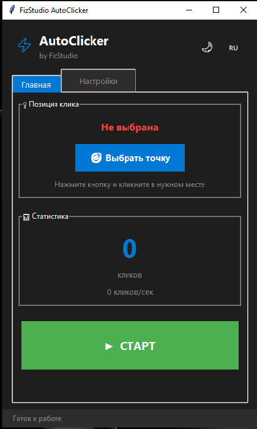

# ⚡ FizStudio AutoClicker

Бесплатный автокликер с поддержкой CPS и продвинутых настроек.



## ✨ Возможности
- 🎯 Клики в выбранной точке без движения курсора
- ⚡ Режим CPS (клики в секунду)
- 🔧 Продвинутые настройки задержек и разброса
- 🎨 Тёмная/светлая тема
- 🌍 Русский и английский язык
- ⌨ Настраиваемые горячие клавиши

## 📥 Скачать
[Скачать последнюю версию](../../releases/latest)

## 🚀 Запуск из исходников
```bash
pip install -r requirements.txt
python autoclicker.py
```
===========================================

⚠️ Антивирус
Программа использует библиотеки keyboard и win32api для работы
с мышью и клавиатурой. Некоторые антивирусы могут ложно
срабатывать. Это безопасно — весь код открыт.

🔗 Связь
Telegram: @chukotskyy


© 2026 FizStudio
